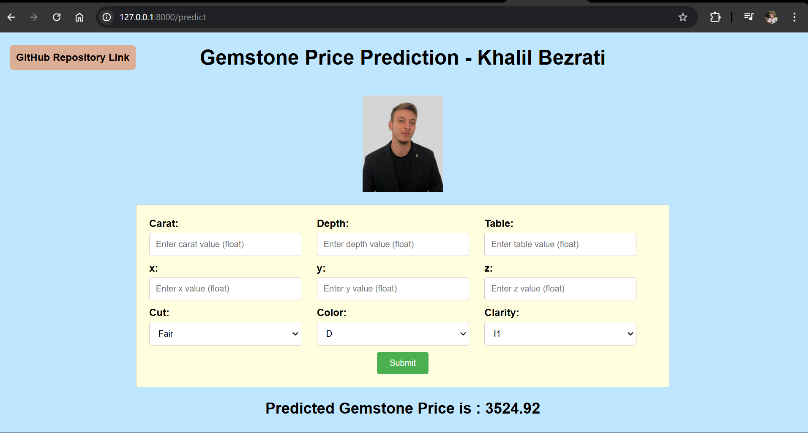
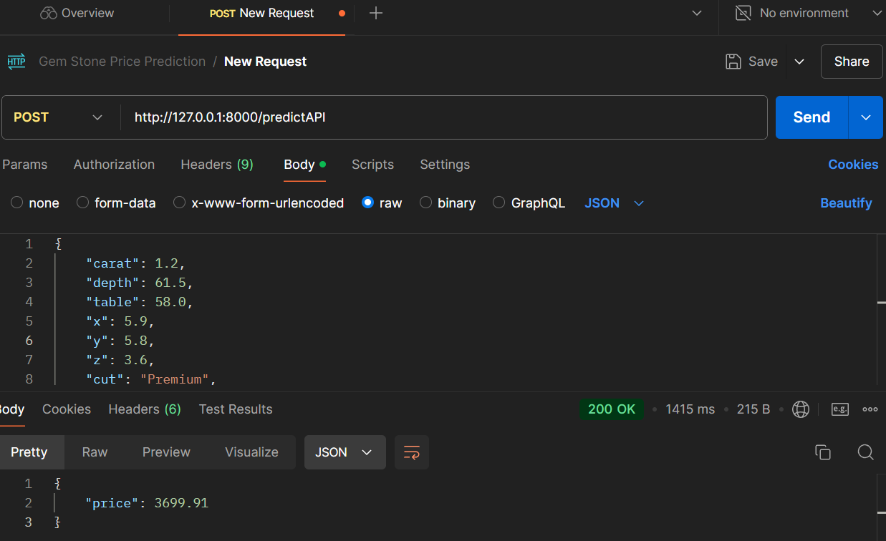
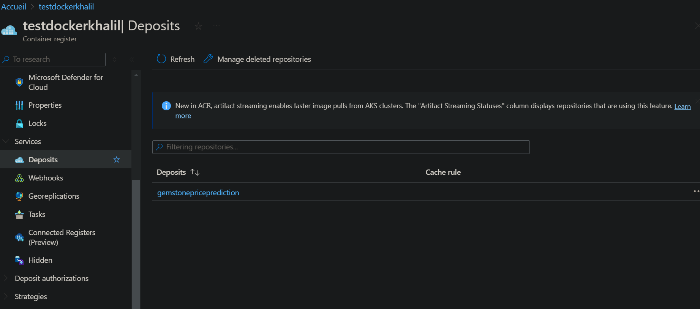
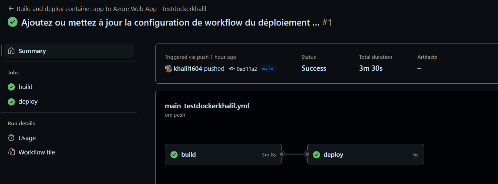

# Table of Contents

- [Gemstone Price Prediction](#gemstone-price-prediction)
- [Approach for the project](#approach-for-the-project)
- [Exploratory Data Analysis Notebook](#exploratory-data-analysis-notebook)
- [Model Training Approach Notebook](#model-training-approach-notebook)
- [Azure ML Model Deployment Guide](#azure-ml-model-deployment-guide-using-azure-container-registry-docker-and-github-actions)


## Key Features
- 🔮 Predicts gemstone prices using VotingRegressor (CatBoost, XGBoost, KNN)
- 🌐 Flask web application with user-friendly interface
- 🐳 Containerized with Docker
- ☁️ Deployed on Azure using Container Registry (ACR)
- 🔄 CI/CD pipeline using GitHub Actions
- 📊 Includes EDA and model training notebooks

## Tech Stack
- Machine Learning: scikit-learn, CatBoost, XGBoost
- Web App: Flask
- Cloud: Azure Web App, Azure Container Registry
- DevOps: Docker, GitHub Actions
- Data Analysis: Pandas, NumPy, Matplotlib

## Live Demo
Try it here: [Gemstone Price Prediction App](https://gempricepredictionkhalilbezrati-ahaac3cwcyc9cmbq.canadacentral-01.azurewebsites.net/)

## Author
Khalil

# Gemstone Price Prediction 
### Introduction About the Data :
 

**The dataset** The goal is to predict `price` of given diamond (Regression Analysis).

There are 10 independent variables (including `id`):

* `id` : unique identifier of each diamond
* `carat` : Carat (ct.) refers to the unique unit of weight measurement used exclusively to weigh gemstones and diamonds.
* `cut` : Quality of Diamond Cut
* `color` : Color of Diamond
* `clarity` : Diamond clarity is a measure of the purity and rarity of the stone, graded by the visibility of these characteristics under 10-power magnification.
* `depth` : The depth of diamond is its height (in millimeters) measured from the culet (bottom tip) to the table (flat, top surface)
* `table` : A diamond's table is the facet which can be seen when the stone is viewed face up.
* `x` : Diamond X dimension
* `y` : Diamond Y dimension
* `x` : Diamond Z dimension

Target variable:
* `price`: Price of the given Diamond.


# Azure Deployment Link :

Azure Web App : [https://gempricepredictionkhalilbezrati-ahaac3cwcyc9cmbq.canadacentral-01.azurewebsites.net/](https://gempricepredictionkhalilbezrati-ahaac3cwcyc9cmbq.canadacentral-01.azurewebsites.net/)

# Screenshot of UI




# Postman Testing of API :



# Approach for the project 

1. Data Ingestion : 
    * the data is ingested from csv and split into training and testing and saved as csv file.

2. Data Transformation : 
    * In this phase a ColumnTransformer Pipeline is created.
    * for Numeric Variables first SimpleImputer is applied with strategy median , then Standard Scaling is performed on numeric data.
    * for Categorical Variables SimpleImputer is applied with most frequent strategy, then ordinal encoding performed , after this data is scaled with Standard Scaler.
    * This preprocessor is saved as pickle file.

3. Model Training : 
    * In this phase base model is tested . The best model found was catboost regressor.
    * After this hyperparameter tuning is performed on catboost and knn model.
    * A final VotingRegressor is created which will combine prediction of catboost, xgboost and knn models.
    * This model is saved as pickle file.

4. Prediction Pipeline : 
    * This pipeline converts given data into dataframe and has various functions to load pickle files and predict the final results in python.

5. Flask App creation : 
    * Flask app is created with User Interface to predict the gemstone prices inside a Web Application.

# Exploratory Data Analysis Notebook

1. Data Manipulation
2. Descriptive Statistics
3. Univariate and Bivariate analysis wih visualization
4. Mutual Information Scores

Link : [EDA Notebook](./notebook/1_EDA_Gemstone_price.ipynb)

# Model Training Approach Notebook

Link : [Model Training Notebook](./notebook/2_Model_Training.ipynb)


# Azure ML Model Deployment Guide using Azure Container Registry, Docker, and GitHub Actions

this part outlines the steps required to deploy an ML project on Azure. We’ll use Azure Container Registry (ACR) to store and manage Docker images, and Azure Web App to host and run the application. The deployment process includes CI/CD (Continuous Integration and Continuous Deployment) through GitHub Actions, making it easier to automate and maintain.

## 1. Resource Group and Azure Container Registry (ACR)

* **Resource Group (`testdockerkhalil`)**: A logical container for managing resources in Azure, including ACR and web apps. It simplifies managing related resources as a unit.
* 
* **Create ACR**: We create an ACR to manage Docker images for our project. The **registry name** and **access keys** will be essential for pushing and pulling images in subsequent steps. ACR securely stores images and enables faster deployment across Azure services.
* **Access Keys and ACR Registry Name**:
   * The **registry name** (e.g., `testdockerkrish.azurecr.io`) uniquely identifies your ACR instance.
   * **Access keys** (Admin account) enable CLI and API access to ACR. These are critical for authenticating Docker commands when interacting with ACR.
 

## 2. Build and Push Docker Image
Building and pushing the Docker image ensures that the latest version of the ML model and its dependencies are in the ACR, ready to be deployed to the web app. Here's a breakdown:

* **Build Docker Image**:
```bash
docker build -t testdockerkrish.azurecr.io/gemstonepriceprediction:latest .
```
This command builds a Docker image named `mltest` with the `latest` tag. Docker creates a layered, portable image of your application, including all required dependencies.

* **Login to ACR**:
```bash
docker login testdockerkrish.azurecr.io
```
This command authenticates your Docker CLI to access the ACR, using the registry name and access keys for security. Successful login allows pushing images to the registry.

* **Push Docker Image**:
```bash
docker push testdockerkrish.azurecr.io/gemstonepriceprediction:latest
```
This command pushes the built image from your local environment to ACR. It's essential for making your application accessible to Azure services for deployment.


 

## 3. Create and Configure Azure Web App
The Azure Web App is the service that will host and run your Docker container.
* **Docker Container Configuration**: During web app creation, select "Docker Container" as the deployment type to use the image stored in ACR.
* Specify the registry name and image details (e.g., `testdockerkrish.azurecr.io/gemstonepriceprediction:latest`) for the web app to pull and run your image.

## 4. Deployment Configuration for CI/CD using GitHub Actions
Using GitHub Actions, we set up a CI/CD pipeline to automate deployments, which makes updates to the ML model seamless. Once configured, any changes to your GitHub repo will automatically trigger the deployment workflow.

* **Deployment Config (GitHub Actions)**:
   * **Enable GitHub Actions** in the Azure portal under the Deployment Center for your web app. This automates the build and deployment when changes are pushed to the repo.
   * **Continuous Deployment** (CI/CD): Ensures new updates in the GitHub repository automatically build and deploy to the web app.

* **Workflow Configuration (workflow.yml)**: This YAML file defines the GitHub Actions workflow. Key steps include:
   * **Checkout Code**: The `checkout` action pulls the latest code from the GitHub repository.
   * **Login to ACR**: Authenticates GitHub to ACR.
   * **Build and Push Docker Image**: Rebuilds and pushes the image on every commit.
   * **Deploy to Web App**: Deploys the updated container from ACR to the Azure Web App.

 

 you can check out the github action part for more logs and details


 Authored by Khalil.


